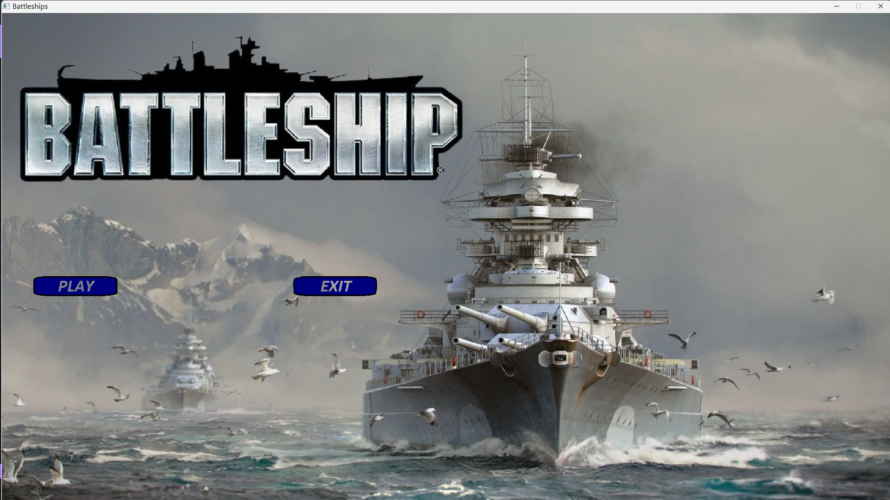
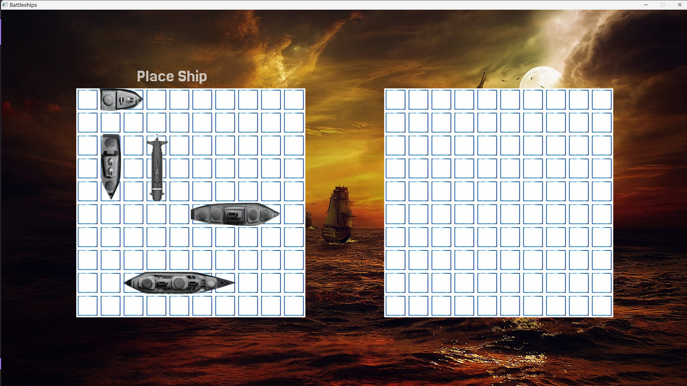
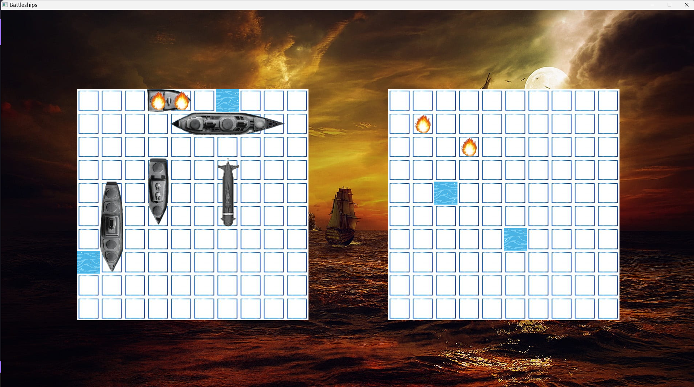
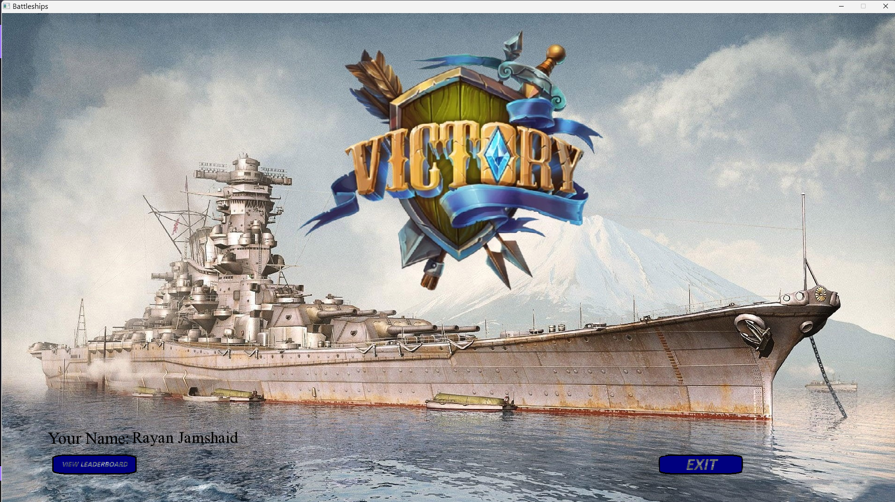
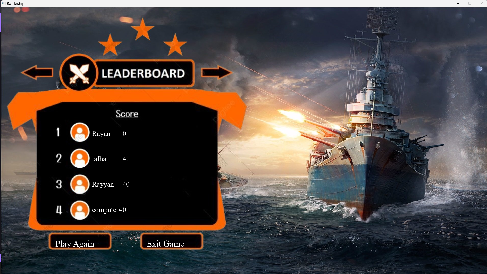

# Battleships - C++ Programming Fundamentals Semester Final Project

## Introduction

**Battleship** is a popular two-player strategic guessing game, played on a 10x10 grid where each player places their fleet of warships in secret locations. The objective of the game is to destroy the opposing player’s fleet by guessing their ship locations. 

In this project, the game is designed to be played by a single user, with the second player simulated by an AI. The AI generates its fleet and makes random shots, following the same rules as the user. The user's score is decremented with every shot made, with the goal being to destroy the opponent’s fleet with as few moves as possible.

## Gameplay

### 1. **Start Page**
   The game begins with a **start page**, where the user is given the option to start a **New Game** or exit. This is the initial screen that leads the user into the game.
.

### 2. **Ship Placement**
   After selecting a new game, the user is directed to the **Ship Placement Screen**. On this screen, the user places their fleet on the 10x10 grid. The ships can be placed horizontally or vertically, with different controls for each:
   
   - **Left Click**: Places a ship horizontally.
   - **Right Click**: Places a ship vertically.
   
   The ships are placed on the grid one at a time, and the game ensures that they do not overlap or go outside the grid. Once all ships are placed, the user can proceed to the **Battle Screen**.


### 3. **Battle Screen**
   The **Battle Screen** is where the core gameplay takes place. In this phase, the user and the AI take turns trying to sink each other's fleet. The user makes guesses on the AI's grid by clicking on coordinates, and the AI makes random shots on the user's grid. 

   The game uses **SFML** (Simple and Fast Multimedia Library) for rendering the game graphics, including the grids, ships, and shots. The screen updates dynamically after each turn to show hits, misses, and sunken ships. 

   - **User's Turn**: The user selects a grid coordinate to shoot at, and the AI will respond with a hit or miss announcement.
   - **AI's Turn**: The AI will make random guesses, and if it hits a ship, it will attempt to continue hitting that ship by choosing adjacent coordinates in an intelligent pattern, until the ship is completely destroyed.


### 4. **AI Behavior**
   The AI generates its fleet randomly and shoots at random positions. However, once the AI hits a user's ship, it intelligently continues targeting that ship, trying to destroy it completely before resuming random shots. This mimics a more advanced AI behavior rather than a purely random shooter.

### 5. **Victory Condition**
   The game concludes when either the user or the AI has sunk all of the opponent’s ships. A **victory screen** is displayed, indicating the winner and their score. The score is calculated based on the number of moves it took to sink all the ships. The fewer the moves, the higher the score, with a maximum score of 100 (representing the 100 possible grid positions). 

   - **User Victory**: If the user successfully sinks all the AI's ships, a victory message is displayed, along with the user's score.
   - **AI Victory**: If the AI sinks all the user's ships, a loss message is shown.


### 6. **Name Input for Leaderboard**
    If the user wins, he is shown the Victory Page.



### 7. **Leaderboard Screen**
   After the name is entered and saved, the user can navigate to the **Leaderboard Screen** from the main menu. This screen displays the top three scores along with the player names, providing a competitive challenge for future playthroughs.



## Features

- **2D Character Arrays for Grids**: 
  The game utilizes **2D character arrays** to represent the 10x10 grids for both players. The grids hold the states of each coordinate (e.g., ship presence, hit, or miss). Ships are placed on these grids, and the game dynamically updates the grids with each move.
  
- **Ship Placement Mechanics**: 
  The placement of ships on the grid is done by checking for overlaps and ensuring the ships fit within the grid boundaries. The user can place ships either horizontally or vertically using mouse controls (left-click for horizontal, right-click for vertical).

- **Graphical User Interface (GUI) with SFML**: 
  The game features a rich GUI built using the **SFML** library, providing a smooth and visually appealing experience. The GUI is responsible for rendering:
  - The grids
  - The ships
  - The game status (hit, miss, sunk ships)
  - Buttons for user interaction (e.g., starting a new game, placing ships, etc.)

- **File Handling for Leaderboard**: 
  The game implements file handling to maintain a **Leaderboard** where the top three players and their scores are saved. The user’s name is prompted and saved after the game ends, allowing for a competitive ranking system based on the number of moves taken to win.

- **Game Loop**: 
  The game operates within a standard **game loop** that continuously processes player input, updates the game state (ship placement, AI actions, grid updates), and renders the changes to the screen. The loop ensures smooth gameplay and real-time interactions.


## Project Structure

The project is organized into the following structure to ensure a clean and modular approach:

```bash
│
├── assets/ # All asset files used in the game (fonts, sounds, images, etc.)
│ ├── fonts/ # Fonts used for rendering text in the game
│ ├── audios/ # Audio files (e.g., sound effects, background music)
│ ├── images/ # Images used for game visuals (e.g., grid, ships, icons, backgrounds)
│ └── texts/ # Text file-> leaderboard data
│
├── SFML/ # SFML library files and their implementation
│ └── (SFML library code) # The SFML library and its header files/code for graphics, window, events, etc.
│
├── Game.cpp # Main game logic and implementation
│ └── Contains the core logic of the game such as game-loop, player turns, AI actions, ship placement, etc.
│
├── Game.h # Header file for Game.cpp
│ └── Contains the declarations of functions, variables used in Game.cpp
│
└── Makefile # To build the project
```
## How to build:

 ### Prerequisites
  - g++ compiler
  - terminal (bash, powershell)
 
 ### Method
 1. - Clone the repository in your computer.
    - Unzip the SFML folder. (you can clone a repository, you know how to unzip a file in you folder)
    - Go to Makefile
    - Change the paths in Makefile as specified
    ```bash
    link: compile
	g++ Game.o -o sfml-app -L"Path to library folder in SFML folder" -lsfml-graphics -lsfml-window -lsfml-system -lsfml-audio -lsfml-network  

    compile:
	    g++ -c Game.cpp -I"Path to include folder in SFML folder"

    ```
    - Run this in your terminal
    ```bash
        make
    ```
    
 2. If you do not want to run makefile, then run this command in your terminal with the path changed
    ```bash
    g++ -c Game.cpp -I"Path to include folder in SFML folder"
    ```
    then run, with path changed
    ```bash
    g++ Game.o -o sfml-app -L"Path to library folder in SFML folder" -lsfml-graphics -lsfml-window -lsfml-system -lsfml-audio -lsfml-network
    ```

## To Run
Run this command in terminal to run your application

```bash
./sfml-app
```

Based on your system, the command can vary, like on windows powershell you will have to run

```bash
./sfml-app.exe
```


## What to do Next
- Improve Graphics
- Add multiplayer functionality
- Put the text cases
- Write automated test case for testing

## License
It is protected by MIT license, whatever it means. Use the software, for good purposes (you can not hack nasa with it right now).

## Programmer
Rayan Jamshaid
C++ Developer
Code;Gate
github: rayanjamshaid
